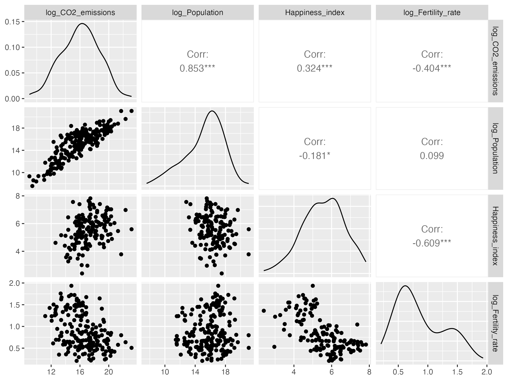
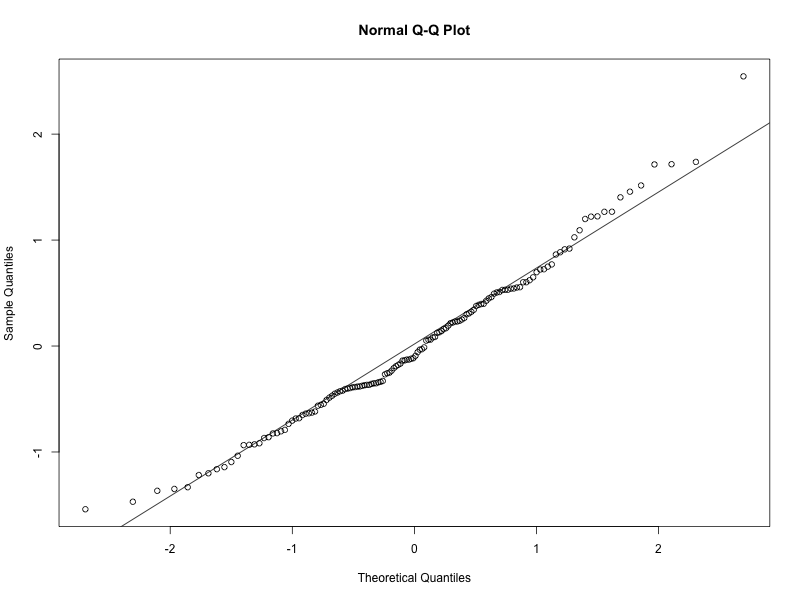
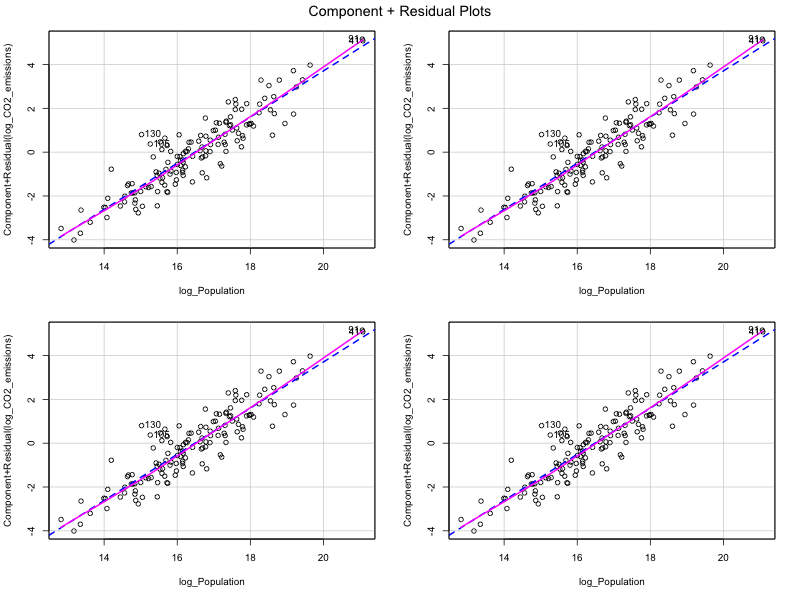
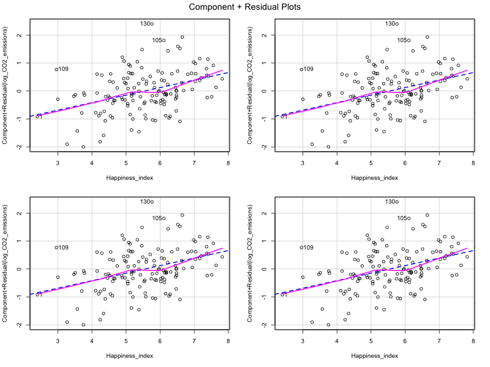
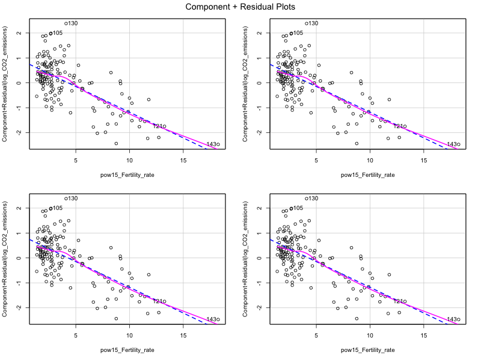

# CO2 Emissions Analysis

## Introduction
This repository contains the code and data for analyzing potential causes of CO2 emissions. The objective was to apply various data analytics techniques to develop a model explaining potential causes of CO2 emissions.

## Dataset
The dataset was sourced from [Our World in Data](https://ourworldindata.org/). It includes variables such as CO2 emissions, population, happiness index, fertility rate, and income level.

## Methodology
The analysis followed a structured approach:

1. **Data Transformation**: Applied logarithmic transformations to normalize the data.
2. **Exploratory Data Analysis (EDA)**: Used bivariate and multivariate visualizations to identify key relationships.
3. **Correlation and Relationship Analysis**: Measured how variables related to CO2 emissions and isolated their individual effects.
4. **Identification of Unusual Observations**: Used Cook's Distance and standardized residuals to pinpoint outliers.
5. **Regression Modeling**: Constructed a series of regression models, refining them based on statistical significance, Adjusted R-squared values, Residual Standard Error, and Akaike Information Criterion (AIC).

### Final Regression Model
The final model included the following variables:
- Log-transformed Population
- Happiness Index
- Log-transformed Fertility Rate
- Income Level

The model achieved an adjusted R-squared of 0.85, indicating that 85% of the variability in CO2 emissions is explained by the model.

### Results
#### Key Findings
- **Population**: Strong positive correlation with CO2 emissions.
- **Happiness Index**: Moderate positive correlation with CO2 emissions.
- **Fertility Rate**: Negative correlation with CO2 emissions.
- **Income Level**: High-income countries generally have higher emissions.

### Examples of Visualizations

#### Correlation Plot


#### Q-Q Plot of Residuals


#### Component Plus Residual Plots
- **Log Population**: Strong linear relationship with CO2 emissions.
- **Happiness Index**: Moderate positive linear trend.
- **Transformed Fertility Rate (1.5 power)**: Negative linear relationship with CO2 emissions.





### Model Performance
The final model's performance was validated using various diagnostic tests:
- **Variance Inflation Factor (VIF)**: Ensured no multicollinearity among predictors.
- **Cook's Distance**: Identified and assessed influential data points.
- **Normality of Residuals**: Q-Q plot indicated that residuals are approximately normally distributed.
- **Homoscedasticity**: Residuals vs. Log Population plot indicated constant variance.

### Getting Started
To get started with this project, clone the repository and ensure you have the necessary dependencies installed.

```bash
git clone https://github.com/yourusername/CO2_Emissions_Analysis.git
